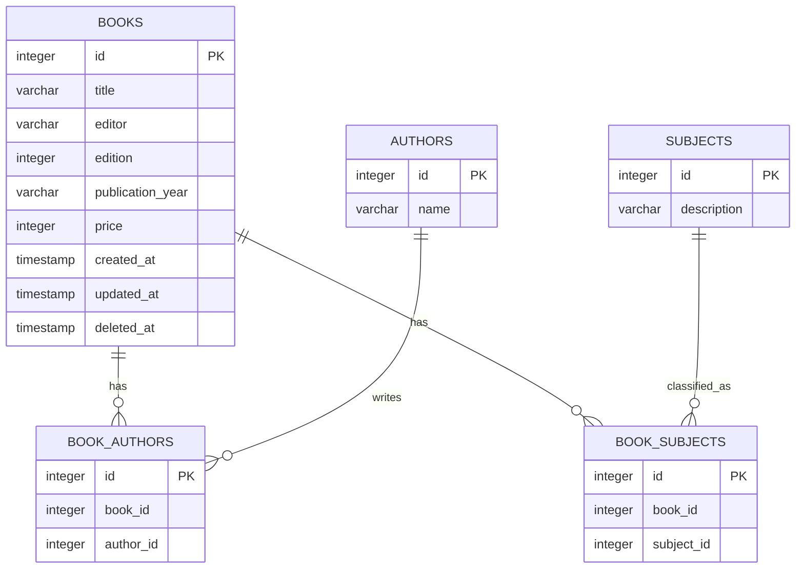

Diagrama de relacionamento de entidades (ERD) para o esquema de banco de dados de uma biblioteca:



```text
Table books {
  id integer [primary key]
  title varchar(40)
  editor varchar(40)
  edition integer
  publication_year varchar(4)
  price integer
  created_at timestamp
  updated_at timestamp
  deleted_at timestamp
}

Table authors {
  id integer [primary key]
  name varchar(40)
}

Table subjects {
  id integer [primary key]
  description varchar(20)
}

Table book_authors {
  id integer [primary key]
  book_id integer
  author_id integer
}

Table book_subjects {
  id integer [primary key]
  book_id integer
  subject_id integer
}

Ref: book_authors.book_id > books.id
Ref: book_authors.author_id > authors.id
Ref: book_subjects.subject_id > subjects.id
Ref: book_subjects.book_id > books.id
```
